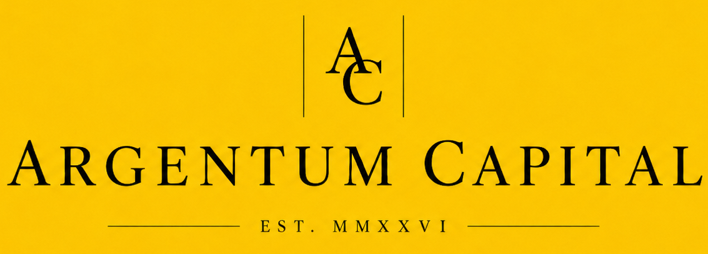

# Argentum Fund

<p align="center">
  
</p>

<p align="center">
  <b>Argentum Capital</b><br>
  A Python-based investment research and timing framework focused on building long-term positions at attractive prices.
</p>

---

## Overview

**Argentum Fund** is a personal investment research project built in Python and versioned on GitHub under the **Argentum Capital** label.

The core idea is simple:

> Good investments are not only about *what* you buy. They are also about *when* you buy.

This project is designed to help identify securities that appear attractive on a longer-term basis, while emphasizing **buy timing**, disciplined cash deployment, and structured portfolio building.

Rather than chasing the fastest possible gains, the Argentum Fund is built around a more measured philosophy:

- identify strong longer-term opportunities
- monitor valuation and price dislocation
- deploy capital gradually and intelligently
- build positions at favorable entry points

The current project has two main research avenues:

### 1. Value Universe Analysis

A research workflow focused on value-oriented securities, especially within the **S&P 500 Value** universe. The objective is to identify securities that have declined in price, yet still display attractive underlying metrics such as:

- Price-to-Earnings Ratio (P/E)
- Price-to-Book Ratio (P/B)
- Price-to-Sales Ratio (P/S)
- EV/EBITDA (Enterprise value relative to operating earnings)
- Dividend Yield
- Free Cash Flow Yield
- other quality and valuation indicators over time

### 2. 13F / Autopilot Supplement

A supporting workflow that evaluates holdings derived from:

- 13F-based portfolios
- copied or mirrored investor portfolios
- Autopilot tracker holdings

The goal here is not to blindly copy public portfolios, but to evaluate the **best-performing or most compelling securities inside those portfolios** using the same valuation, quality, and timing logic.

---

## Project Philosophy

Argentum Fund is not intended to be a high-frequency trading system or a prediction machine.

It is intended to be a **decision support system** for longer-term investing.

The emphasis is on:

- disciplined accumulation
- timing entries rather than reacting emotionally
- managing cash deployment during uncertainty
- comparing value and momentum in a practical way
- learning through transparent, repeatable analysis

In practical terms, this means the program aims to answer questions such as:

- Which securities currently look attractive?
- Are they cheap for a good reason or a bad reason?
- Is now a reasonable time to buy?
- Should new cash be deployed normally, accelerated, or held?
- Are there strong candidates inside a copied 13F or Autopilot portfolio?
- Is portfolio concentration becoming too high?

---

## Current Status

### Implemented

- Config-driven universe building
- Manual CSV universe support
- Standardized schema for securities and strategy sleeves
- Support for synthetic internal identifiers such as cash holdings
- Support for international CSV conventions including comma-decimal formats
- Standardized `current_universe.csv` output for downstream analysis

### In Progress

- Historical price ingestion
- Value / quality / momentum factor generation
- Buy-timing signals
- Cash deployment logic
- Tracker-specific portfolio analysis

---

## Core Concepts

### Universe Builder

The universe builder creates a standardized investment universe from either:

- manual CSV inputs
- future SEC 13F ingestion workflows

This ensures that all later analysis operates on a consistent structure.

### Timing First

A major goal of the project is to identify **when to buy**, not only what to buy.

That means the platform is designed to consider:

- drawdowns from recent highs
- rolling returns
- valuation changes
- quality metrics
- potential recovery signals
- cash available for deployment

### Research-Oriented Development

This project also serves as a software and research portfolio. It is being developed to improve skills in:

- Python programming
- modular software design
- GitHub version control
- financial data analysis
- quantitative research workflows
- eventual machine learning experimentation

---

## Planned Features

The roadmap is intentionally modular. Future versions may include:

### Short-Term Priorities

- price history builder
- factor engine for valuation, quality, momentum, and risk
- ranking engine for candidate securities
- weekly report generation
- market condition summaries
- portfolio overlap and concentration analysis
- paper portfolio support for testing alternative ideas

### Medium-Term Features

- SEC 13F ingestion module
- Autopilot holding analyzer
- configurable scoring engine
- backtesting framework
- buy-signal calibration
- performance comparison against benchmarks such as VTI, VOO, or value ETFs

### Longer-Term Possibilities

- sell-discipline module
- rebalancing rules engine
- brokerage API integration
- alert system for buy and sell conditions
- dashboard or web app interface
- machine learning or ranking models
- market regime detection
- paper trading or simulation environment

---

## Example Long-Term Vision

A mature version of Argentum Fund could eventually support a workflow like this:

1. Build or refresh the investment universe
2. Pull price and fundamental data
3. Score securities on value, quality, and timing
4. Compare opportunities within the value universe and 13F-based portfolios
5. Generate a ranked list of candidates
6. Recommend whether to buy now, scale in gradually, or wait
7. Track performance in both live and paper portfolios
8. Eventually identify not only **when to buy**, but also **when to trim or sell**

---

## Repository Structure

A simplified project structure is expected to look like this:

```text
argentum-fund/
│
├── README.md
├── requirements.txt
├── config/
│   └── universe_config.yaml
│
├── data/
│   ├── manual/
│   ├── processed/
│   └── outputs/
│
├── src/
│   ├── universe/
│   ├── data/
│   ├── features/
│   ├── scoring/
│   ├── portfolio/
│   ├── reports/
│   └── backtest/
│
└── tests/
```

---

## Legal Disclaimer

**Argentum Fund is a personal software and research project.**

The author is **not a licensed financial advisor, investment adviser, broker, or other regulated financial professional**. Nothing in this repository constitutes:

- financial advice
- investment advice
- tax advice
- legal advice
- a solicitation to buy or sell any security
- an offer to manage money or operate an investment fund

All content in this repository is provided for **educational, research, and software development purposes only**.

Any investment decisions made using this code, analysis, or output are made **entirely at the user’s own risk**. Markets involve risk, including the possible loss of principal. Past performance does not guarantee future results.

No warranties or guarantees are made regarding:

- accuracy
- completeness
- reliability
- timeliness
- fitness for a particular investment purpose

Users should conduct their own due diligence and, where appropriate, consult a qualified financial professional before making investment decisions.

---

## AI Usage Disclosure

This project was developed with the assistance of **generative AI tools**.

Generative AI was used to assist with:

- brainstorming project structure
- drafting code scaffolding
- discussing system design
- refining documentation
- exploring analytical ideas

All code, documentation, and investment logic should be reviewed critically by the project owner and by any downstream user. AI assistance does **not** imply correctness, financial suitability, or regulatory compliance.

---

## Branding Note

**Argentum Fund** is the name of this repository and research project.  
**Argentum Capital** is the branding identity used in project materials and visuals.

This branding is informal and conceptual. It does **not** indicate the existence of a registered investment company, fund, adviser, or legal financial entity.

---

## Why This Project Exists

This project sits at the intersection of several interests:

- long-term investing
- value-oriented research
- disciplined portfolio construction
- software engineering
- GitHub-based project development
- quantitative thinking
- learning by building

At its best, Argentum Fund should become both:

1. a practical investment research tool
2. a serious public software project that demonstrates technical growth over time

---

## Contributing

This is currently a personal project, but feedback, discussion, and constructive ideas are welcome.

---

## Future Versions

Planned releases may gradually expand the project from a universe-building and buy-timing framework into a broader research platform that includes:

- sell signal logic
- backtesting
- portfolio comparison
- paper trading
- broker integrations
- reporting dashboards
- machine learning experiments

The immediate focus, however, remains clear:

> build a disciplined framework for identifying attractive securities and improving the timing of long-term buys.

---

## License

License to be added.

---

## Author

**Jaemin Eun**  
GitHub project under the **Argentum Capital** label.
